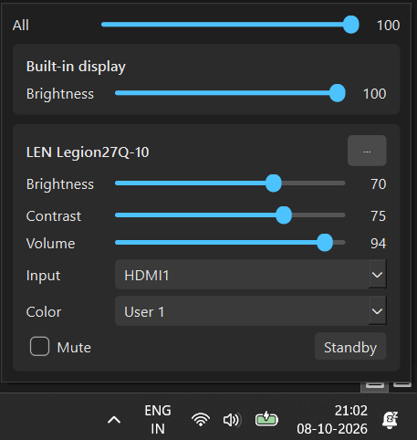

# DDC Panel

A small Windows tray app for controlling your monitors' brightness, contrast,
volume and input source, similar to Monitorian. It works with external monitors
over DDC/CI and with laptop built-in screens through Windows' own brightness
interface.



## Features

- Brightness slider for every connected display, opened from the tray icon
- An "All" slider that moves every display together, scaled to each one's range
- Contrast, volume, mute, input source and color preset for monitors that support them
- Laptop built-in screen support through WMI, the same interface as the Windows brightness slider
- Only shows the controls each monitor actually supports
- Smooth sliders: while you drag, only the latest value is sent, so the monitor never lags behind
- Reconnects automatically when a monitor is switched off and on or replugged
- Optional start with Windows

## Download

Get `DDCPanel.zip` from the [Releases](https://github.com/Noface07/ddcpanel/releases) page,
extract it anywhere, and run `DDCPanel.exe`. Keep the `_internal` folder next to the
exe; the app needs it.

Windows may show a SmartScreen warning because the exe isn't code-signed.
Click **More info → Run anyway**.

## Usage

- **Left-click** the sun icon in the tray to open the panel.
- **Right-click** it for **Rescan displays**, **Start with Windows** and **Quit**.
- Click **⋯** on a monitor's card for its extra controls.

On Windows 11, new tray icons are hidden in the overflow area. To keep the icon
visible, go to Settings → Personalization → Taskbar → Other system tray icons and
turn on DDC Panel.

## Building from source

Requires Python 3.10 or newer.

```bat
git clone https://github.com/Noface07/ddcpanel.git
cd ddcpanel
build.bat
```

The app is written to `dist\DDCPanel\`, and a zip of it to `dist\DDCPanel.zip`.

To run it without building:

```bat
py -m venv .venv
.venv\Scripts\activate
pip install -r requirements.txt
python ddcpanel.py
```

## Troubleshooting

**A monitor says "No response over DDC/CI".** Enable DDC/CI in the monitor's
on-screen menu. Docks, USB-C hubs, DisplayLink adapters and KVM switches often
block DDC/CI, so try connecting the monitor directly to the computer.

**Input and mute work, but brightness and contrast don't.** Open the monitor's own
menu. If Brightness is greyed out there, a picture mode is locking it. Turn off
Windows HDR (Settings → System → Display), switch the monitor to a Standard or
User picture mode, and disable dynamic contrast, eco and eye-saver modes.

**The monitor won't wake from Standby.** Many monitors ignore DDC/CI while in
standby. Press Win+P, choose "PC screen only", then switch back to "Extend", or
press the monitor's power button.

**The laptop screen's brightness keeps changing by itself.** Turn off automatic
brightness in Settings → System → Display → Brightness.

## How it works

External monitors are controlled with [monitorcontrol](https://github.com/newAM/monitorcontrol),
which sends VESA MCCS commands over DDC/CI. Laptop screens don't support DDC/CI, so
they're controlled through the `WmiMonitorBrightnessMethods` WMI class instead.
Each display has its own background thread, so slow hardware never freezes the
interface.

## Credits

- [monitorcontrol](https://github.com/newAM/monitorcontrol) by newAM, which provides the DDC/CI communication (MIT license)
- Inspired by [Monitorian](https://github.com/emoacht/Monitorian)

## License

MIT